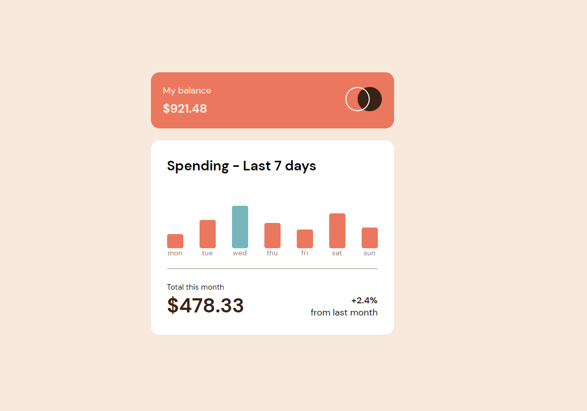

# Frontend Mentor - Expenses chart component

## The challenge

Your users should be able to:

- View the bar chart and hover over the individual bars to see the correct amounts for each day
- See the current day's bar highlighted in a different colour to the other bars
- View the optimal layout for the content depending on their device's screen size
- See hover states for all interactive elements on the page
- **Bonus**: See dynamically generated bars based on the data provided in the local JSON file

## Bonus: 

- My solution to the bonus challenge was 'bar.style.height = `${datas[index].amount / 10}rem`;' this. I took the amount data out of the JSON file divided it by 10 and gave the bars height the result.

## Difficulties:

- I've had difficulties with giving the bar the price while also removing the previous price, but I managed to do it with a foreach in a foreach which isnt the most beautiful solution, but hey it works! :D

## Live site URL:

- 

## If you have any advice on how can I improve send me a DM on twitter!
